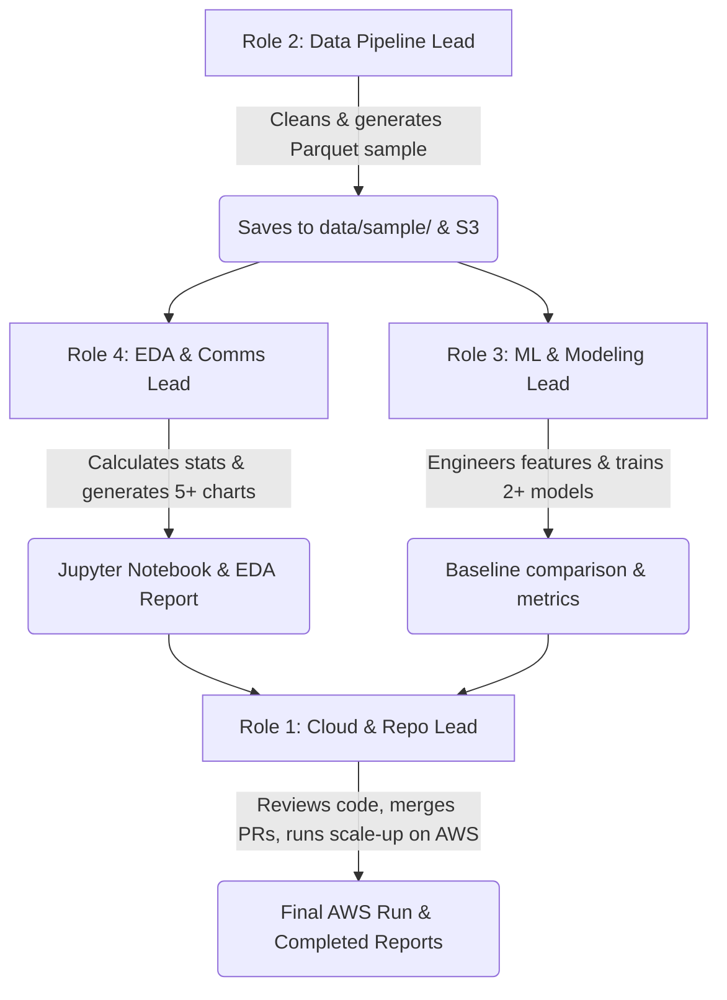

# Team Roles and Task Dissemination

This document outlines the division of responsibilities and task dissemination for our group of **4 members**. Since **CJ** (the repository owner) is the only member with significant AWS experience, they are responsible for maintaining the AWS infrastructure, repository maintenance, and scale-up execution. Other tasks are distributed across the team to cover all project phases.

> [!NOTE]
> These role assignments serve as primary boundaries to ensure clear ownership and a balanced workload. However, they are tentative and subject to change as the project progresses. All group members are expected to collaborate across phases and assist each other during peak workloads.

---

## 1. Role Assignment Overview

The project is divided into four distinct roles. Each role is designed to have a comparable workload across both Phase 1 (Descriptive Analytics) and Phase 2 (Predictive Analytics).

| Role       | Title                                      | Core Focus                                                       | Member       |
| :--------- | :----------------------------------------- | :--------------------------------------------------------------- | :----------- |
| **Role 1** | **Cloud Infrastructure & Repository Lead** | AWS Environment, Repository Health, Integration, Scale-Up        | CJ           |
| **Role 2** | **Data Engineering & Pipeline Lead**       | Data Ingestion, Cleaning, Profiling, Downsampling                | _Teammate A_ |
| **Role 3** | **Machine Learning & Modeling Lead**       | Target Framing, Feature Engineering, Model Training & Eval       | _Teammate B_ |
| **Role 4** | **Exploratory Analytics & Comms Lead**     | Descriptive Stats, Data Visualization, Report Writing, Deadlines | _Teammate C_ |

---

## 2. Detailed Role Responsibilities

### Role 1: Cloud Infrastructure & Repository Lead (CJ)

Responsible for maintaining the system backbone, ensuring repository health, and orchestrating the final production scale-up on AWS.

- **AWS Infrastructure Maintenance:**
  - Configure and maintain the Central S3 Hub bucket (`dat204m-binance-bigdata-hub-sg`).
  - Implement the cross-account bucket policy and Glue Catalog permissions to allow teammates' AWS accounts to query the data via Athena.
  - Build Glue Crawlers to maintain the metadata catalog of the raw and sample datasets.
- **Repository & Workflow Management:**
  - Maintain the GitHub repository structure and project settings.
  - Review and merge Pull Requests from teammates to enforce code quality, dependency management (via `pyproject.toml` and `uv`), and clean formatting (`ruff`).
  - Manage Git branching strategy and documentation logs.
- **Production Scale-Up Execution:**
  - Once the pipeline and ML models are validated locally on the sample data, pull the code to the AWS Central Hub.
  - Execute the end-to-end pipeline against the full 75+ GB raw dataset (using SageMaker, EMR, or local server compute).
  - Optimize S3 paths and credentials in `src/config.py`.

---

### Role 2: Data Engineering & Pipeline Lead (Teammate A)

Responsible for acquiring the data, building data ingestion pipelines, cleaning records, and generating the downsampled development dataset.

- **Data Ingestion & Extraction:**
  - Build and maintain the bulk historical data downloader (`src/pipeline/download_klines.py`) using `binance-historical-data`.
  - Ensure raw files are properly placed in the git-ignored local folder (`data/raw/`).
- **Cleaning & Preprocessing Pipeline:**
  - Write the core cleaning script (`src/pipeline/preprocess.py`) using DuckDB for high-speed processing.
  - Implement deduplication, check for missing timestamps, handle anomalies, and document data quality choices.
- **Downsampling & Sampling Generation:**
  - Build the sampling script (`src/pipeline/sample_generator.py`) to extract 1-minute frequency data for the top 20 most liquid cryptocurrency pairs.
  - Export the cleaned sample as a compressed Parquet file (`data/sample/binance_sample.parquet`).
- **Documentation:**
  - Document data profile details, column types, row counts, and data schemas in `docs/data_profile.md`.

---

### Role 3: Machine Learning & Modeling Lead (Teammate B)

Responsible for defining the mathematical problem, engineering predictive features, training algorithms, and validating predictive quality.

- **Problem Framing & Baseline Definition:**
  - Define the Machine Learning target variable (Binary Price Direction Classification: UP vs. DOWN/FLAT) and configure time horizons ($N$ steps).
  - Implement a baseline model (e.g., Majority Class Classifier) inside `src/models/baselines.py` to establish a performance benchmark.
- **Feature Engineering:**
  - Write modular feature extraction code (`src/features/indicators.py`) using Polars.
  - Compute technical indicators: Simple Moving Average (SMA), Exponential Moving Average (EMA), Relative Strength Index (RSI), Bollinger Bands, and rolling historical returns.
- **Model Training & Evaluation:**
  - Write training orchestrations (`src/models/train.py`) to split the data (80/20 train/test split) and train at least two separate ML algorithms (e.g., Random Forest, Logistic Regression, or XGBoost).
  - Calculate performance metrics (accuracy, precision, recall, F1-score, and confusion matrix).
  - Perform hyperparameter tuning and document the search space.

---

### Role 4: Exploratory Analytics & Comms Lead (Teammate C)

Responsible for conducting descriptive analysis, creating visual assets, writing project reports, and keeping the team on schedule.

- **Exploratory Data Analysis (EDA):**
  - Conduct the descriptive stats profile on the downsampled dataset (calculating mean, median, standard deviation, IQR, and distribution shapes for all numerical values).
  - Author the EDA Jupyter Notebook (`notebooks/01_eda_descriptive_analytics.ipynb`).
- **Visualizations & Insights:**
  - Produce at least 5 descriptive charts (histograms of returns, correlation heatmaps, price time-series plots, volume distributions, etc.) and write analytical interpretations for each.
  - Connect analytical findings to the underlying business problem.
- **Communications & Deliverables Management:**
  - Write the project proposal and compile the written EDA Report.
  - Lead the drafting of the Final Written Report by aggregating code/models from the Data and ML leads.
  - Structure and build the presentation slide deck and manage submission deadlines.

---

## 3. Workflow and Collaboration Cycle

To ensure that the team collaborates efficiently, we will follow a structured weekly workflow:

1. **Local Development First:** Teammates develop and verify all code locally using the downsampled Parquet dataset generated by Role 2.
2. **Review and Integration:** Pull Requests are submitted to Role 1 (CJ). After verification and peer review, they are merged into the main branch.
3. **Scale-Up Execution:** Once merged, Role 1 (CJ) configures the run mode to AWS Central Hub and executes the code against the full 75+ GB uncompressed dataset in the AWS cloud environment.
4. **Final Reporting:** Role 4 coordinates the collection of metrics, charts, and write-ups to assemble the final reports and presentations.
